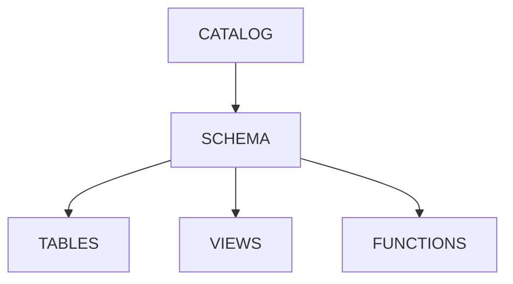
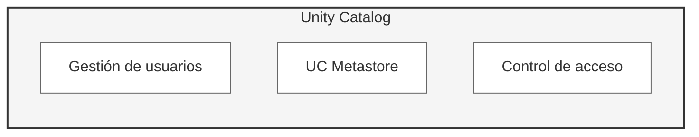
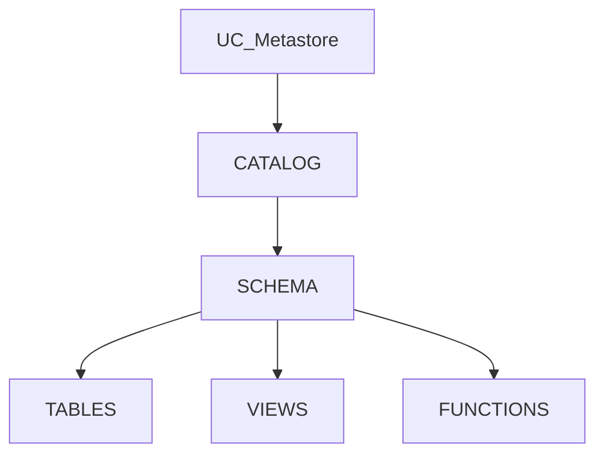

# Databricks Certified Data Engineer Associate
<p align="center">
  
</p>

## Información de la Certificación

El examen de certificación de Asociado en ingeniería de datos certificado por Databricks evalúa tu capacidad para utilizar Databricks Data Intelligence Platform con el fin de completar tareas introductorias de ingeniería de datos.

El examen abarca lo siguiente:

1.  Databricks Intelligence Platform - 10 %
2.  Procesamiento y transformaciones de datos - 31 %
3.  Desarrollo e ingesta - 30 %
4.  Puesta en producción de canalizaciones de datos: 18 %
5.  Gobernanza y calidad de los datos: 11 %

El examen consta de 45 preguntas con un límite de tiempo de 90 minutos.

Para información más detallada del examen revisar [información de la certificación](https://github.com/atrigueroshol/Databricks-Certified-Data-Engineer-Associate/blob/main/databricks-certified-data-engineer-associate-exam-guide-july-30-2025-0.pdf)

## 1. Databricks Intelligence Platform

### Qué es Databricks

Databricks es una plataforma multicloud para data lakehouse basada en Apache Spark.

Un **data lakehouse** es una plataforma que unifica las ventajas de un data lake y un data warehouse.

<p align="center">
  
</p>

### Arquitectura
La arquitectura de la plataforma de **Databricks** es la siguiente:

1.  **Cloud Service**  
    Databricks es una plataforma **multicloud** y puede desplegarse sobre **Amazon Web Services (AWS)**, **Microsoft Azure** y **Google Cloud**.  
    El proveedor cloud se encarga de la **infraestructura**, como máquinas virtuales, redes, almacenamiento y la creación de **clusters**.
    
2.  **Runtime**  
    El Databricks Runtime está basado en **Apache Spark** e integra **Delta Lake**, que proporciona transacciones ACID, control de versiones y fiabilidad sobre el data lake.
    
3.  **Workspace**  
    El Workspace es la **interfaz gráfica** de Databricks que permite realizar tareas de **Data Engineering, Data Warehousing (SQL/BI) y Machine Learning**, mediante notebooks, jobs, dashboards y herramientas colaborativas.
    
<p align="center">
  
</p>

En Databricks existen dos planos principales:

-   **Control Plane**: gestionado por Databricks, se encarga de la interfaz web, APIs, orquestación de jobs, gestión de metadatos y control de acceso.
    
-   **Data Plane**: desplegado en la suscripción cloud del cliente, contiene los clusters y es donde ocurre el cómputo y el acceso al almacenamiento (S3/ADLS/GCS).

### Clusters

Recordemos que un cluster es un conjunto de máquinas que trabajan juntas. A las máquinas de un cluster se las conoce como nodos. 
```
Cluster
├─ Master Node (ResourceManager)
└─ Worker Nodes (NodeManager)
    └─ Contenedores
        ├─ Driver (coordina)
        └─ Executors (ejecutan tareas)
```
Para profundizar sobre este tema revisar [documentación de pyspark](https://github.com/atrigueroshol/PYSPARK).

Para crear un cluster debemos ir a la pestaña de "compute" en el menú de la izquierda y seleccionar la opción de "create compute" y se nos abrirá un formulario para crear un cluster con las siguientes opciones:

 - Policy:
 - Nº de nodos:
	 - Multi-node: para tener varios nodos workers.
	 - Single-node: no tiene nodos workers y realiza todas las operaciones en el nodo driver.
 - Access mode: El número de personas que van a poder utilizar el cluster.
	 - Single user
	 - Shared
 - Versión de Databricks: es la imagen virtual que viene con las versiones de Spark y Scala instaladas.
 - Worker type:
	 - Se deben elegir cores y memoria de los nodos workers.
	 - El número mínimo y máximo de workers en caso de habilitar el autoescalado. Si se deshabilita la opción de autoescalado simplemente se deberá seleccionar el número de workers fijo.
	 - Spot instances: habilitar esta opción utiliza máquinas virtuales más baratas pero interrumpibles por el proveedor cloud. No se recomienda para procesos críticos, streaming y cargas que no toleran reintentos.
 - Se debe elegir la configuración del nodo driver.
 - Apagado del cluster después de un tiempo de inactividad.

Una vez finalizada la configuración se nos indica el número de DBU/h del cluster si estuviera activo. En la página de Databricks se puede consultar el precio de DBU/h.

Una vez creado el cluster podemos ver los logs generados por los clusters, editar los permisos, editar la configuración del cluster (requiere un reinicio para la nueva configuración). También podemos apagar el cluster con la opción "terminating", lo que liberará los recursos de cómputo y almacenará los datos en el cloud storage garantizando la persistencia de los datos. 

#### Clusters Buenas Prácticas

La computación en Databricks se divide en dos tipos:
- Classic
- Serverless

##### Classic
Los **Classic clusters** proporcionan una infraestructura flexible y configurable basada en máquinas virtuales gestionadas por el proveedor cloud.

- All purpose: Se usan para el desarrollo de notebooks, análisis interactivo y consultas ad-hoc. Se crean manualmente, pueden iniciarse desde la interfaz de usuario, línea de comandos o API. Se pueden terminar manualmente o tras un periodo de inactividad. Tienen mayor coste que los jobs ya que permanecen más tiempo activos.

- Jobs: Se utilizan para ejecutar jobs programados y pipelines de ETL. Se crean automáticamente por el job scheduler, se eliminan cuando el job termina y son más baratos que los All purpose porque solo existen durante la ejecución.

- Pools: Son un conjunto de máquinas virtuales preinicializadas que los clusters pueden reutilizar. Reducen el tiempo de arranque y escalado.

- SQL Warehouses

A la hora de crear nuestro classic cluster tenemos que elegir el tipo de nodos worker que queremos:

- Memory Optimized: Se utiliza cuando hay muchas operaciones shuffle, cuando hay almacenamiento en cache y para cargas de ML.
- Compute Optimized: Se utiliza para streaming jobs, para ELT con un full scan y para ejecutar comandos de OPTIMIZE con Z-ORDER.
- Storage Optimized: Para aprovechar caching delta, para consultas ad-hoc y análisis interactivo de los datos.
- GPU Optimized: Para cargas de ML y DL con una alta necesidad de memoria.
- General Purpose: Se utiliza cuando no hay unos requisitos claros o para ejecutar comandos VACUUM.

Cuando creamos el cluster también podemos seleccionar la opción de **spot instances**. Esta opción nos permite usar máquinas a un precio más barato porque usan capacidad sobrante, pero pueden ser interrumpidas por el proveedor en cualquier momento. Son ideales para cargas batch o entrenamiento de machine learning.

##### Serverless
- Serverless: ofrece una simplificación y una gestión completa donde los recursos son manejados por Databricks. Por lo que no hay necesidad de configurar manualmente la infraestructura.

	- Notebooks
	- Jobs
	- Pipelines
	- SQL warehouses


### Notebooks
Los notebooks por defecto tienen Python como lenguaje pero se puede modificar. Además, se pueden combinar varios lenguajes en un mismo notebook añadiendo % al principio de una celda.
```
%python   → Ejecuta código Python (por defecto)
%sql      → Ejecuta consultas SQL (Spark SQL)
%scala    → Ejecuta código Scala
%r        → Ejecuta código R
%md       → Celdas de documentación en Markdown
%run      → Permite ejecutar otro notebook
%fs       → Permite interactuar con el sistema de archivos
```
Además, Databricks proporciona **dbutils**, que permite interactuar con el entorno del workspace y del cluster, facilitando tareas de administración, exploración de datos y gestión de pipelines desde los notebooks.

#### Explorador de Variables
El Variable Explorer permite ver de forma rápida todas las variables definidas en una sesión del notebook, mostrando su nombre, tipo de dato y valor actual. Además, para DataFrames de Spark y Pandas, muestra dimensiones, nombres de columnas y permite consultar el esquema completo al pasar el cursor.

### Python Debugger
Databricks Notebooks ahora permiten depuración interactiva para inspeccionar la ejecución de código Python en tiempo real. Puedes definir breakpoints directamente en el notebook para pausar la ejecución y revisar valores de variables, lo que facilita detectar errores de lógica.

Para iniciar el depurador en Databricks:
1.  Añade uno o más breakpoints haciendo clic en el margen de una celda.
2.  Haz clic en “Debug cell”.
3.  Se inicia una sesión de depuración donde puedes avanzar paso a paso usando la barra de herramientas.

##### Versiones
Databricks permite ver las anteriores versiones de un notebook y restaurarlas. Únicamente tenemos versiones pero no tenemos ramas de versionado.

### Carpetas Git

Las Git Folders de Databricks son un cliente visual de Git integrado en el workspace que permite conectar repositorios remotos directamente dentro del entorno de trabajo.

Permiten desarrollar código en notebooks y archivos siguiendo buenas prácticas de desarrollo de software, utilizando Git para:

-   Control de versiones
-   Colaboración 
-   Integración y despliegue continuo (CI/CD)

Proporcionan control de código fuente para proyectos de datos e IA mediante integración con proveedores Git (como GitHub, GitLab, Azure DevOps, etc.).

En Databricks se puede: 
-   Clonar un repositorio remoto
-   Hacer _push_ y _pull_  
-   Crear y gestionar ramas
-   Hacer _merge_, _rebase_ y resolver conflictos  
-   Crear y editar notebooks (incluyendo formato IPYNB) y otros archivos
-   Comparar visualmente cambios antes de hacer commit
-   Resolver conflictos de merge desde la interfaz

Destacar que **no se puede crear una pull request ni eliminar una rama**. Estas acciones deben realizarse desde el proveedor de Git.

### Delta Lake
Delta Lake es un framework de código abierto que añade transacciones ACID, control de versiones y fiabilidad a los data lakes.  
Es un componente que está desplegado en el cluster como parte del runtime. Cuando creamos una tabla Delta se almacena en el almacenamiento en varios ficheros de datos de tipo Parquet y Delta logs en formato JSON.

 -   **Data Files**  
    Los datos se almacenan en **ficheros Parquet**. Cada vez que se realiza una operación de **escritura, actualización o borrado**, se crean **nuevos ficheros Parquet** con los datos actualizados y se **marcan como obsoletos** los ficheros anteriores (no se eliminan inmediatamente).
    
-   **Delta Log**  
    El _Delta Log_ guarda un **registro de todas las transacciones** realizadas sobre la tabla y actúa como la **fuente de verdad** de su estado.  
    Cada fichero **JSON** contiene información sobre la operación realizada (add, remove, metadata, etc.) y los **ficheros de datos afectados**.

#### Crear Tablas
```sql
CREATE TABLE users(
id INTEGER,
name STRING,
surname STRING,
age INTEGER
)
```

#### Insertar Datos
```sql
INSERT INTO  users (id, name, surname, age) VALUES
(1, 'Ana', 'Gómez', 28),
(2, 'Luis', 'Martínez', 35),
(3, 'Carla', 'Rodríguez', 22),
(4, 'Javier', 'Pérez', 40),
(5, 'Sofía', 'López', 30);
```

#### Descripción de la tabla
La operación **DESCRIBE DETAIL** devuelve metadatos completos de la tabla: 
```sql
DESCRIBE DETAIL  users
```

Ejemplo.
```
format: delta
name: users
location: dbfs:/user/hive/warehouse/users
numFiles: 5
sizeInBytes: 20480
partitionColumns: []
```
#### Historial de la tabla
La operación **DESCRIBE HISTORY** devuelve el historial de cambios de una tabla:
```sql
DESCRIBE HISTORY users
```
Ejemplo.
```
version | timestamp           | operation | operationMetrics
-------------------------------------------------------------
5       | 2026-02-18 10:15:30 | WRITE     | {numOutputRows=5}
4       | 2026-02-17 18:02:11 | DELETE    | {numDeletedRows=2}
3       | 2026-02-16 09:40:00 | MERGE     | {numTargetRowsUpdated=3}

```

#### Consultar tabla y versiones antiguas
En Databricks se puede consultar una tabla y versiones anteriores.
```sql
-- VERSION ACTUAL
SELECT * FROM users;
--VERSION ANTIGUA
SELECT * FROM users VERSION AS OF 1;
SELECT * FROM users@v1;
```
Para saber el número de la versión que queremos consultar podemos utilizar DESCRIBE HISTORY.

#### Restaurar una versión antigua
En Databricks podemos restaurar una versión antigua de la tabla con **RESTORE TABLE**.
```sql
RESTORE TABLE users TO VERSION AS OF 1;
```

#### Compactar ficheros
Con **OPTIMIZE** podemos optimizar el rendimiento de las consultas reorganizando los ficheros de datos. Como ya sabemos cada operación sobre una tabla crea un archivo y con OPTIMIZE unifica esos archivos pequeños en archivos más grandes.
```sql
OPTIMIZE users;
```

#### Indexación de ficheros
Para la indexación de nuestros datos debemos utilizar la operación **ZORDER**, que reorganiza los datos de los ficheros para mejorar el rendimiento de las consultas. 
```sql
OPTIMIZE users
ZORDER BY (surname, age);
```

#### Limpieza de ficheros
Con la operación **VACUUM** eliminamos los ficheros de datos que ya no están en uso. Debemos tener cuidado a la hora de ejecutar este comando ya que una vez hecho no podemos restaurar o consultar versiones anteriores de la tabla.
```sql
VACUUM users
```

#### DATA FILE LAYOUT 
Data file layout es la organización física de los ficheros que forman una tabla Delta. Optimizando la capa de data files se puede mejorar significativamente el tiempo de ejecución y el consumo de recursos de las consultas.

Vamos a estudiar tres técnicas principales para optimizarla.

La primera técnica es el **partitioning**.  
Databricks crea una partición por cada valor distinto de la columna por la que se particiona, generando una carpeta por cada valor de la partición.

`CREATE TABLE users (
  id INTEGER,
  name STRING,
  surname STRING,
  age INTEGER ) USING DELTA
PARTITIONED BY (age);` 
 
El particionado puede mejorar mucho el rendimiento de las consultas cuando las tablas Delta son grandes, ya que permite pruning de particiones (solo se leen las carpetas necesarias).

Buenas prácticas
-   Particionar por columnas con baja cardinalidad
-   Usar columnas frecuentes en cláusulas `WHERE`
-   Evitar particionar por columnas con muchos valores distintos
    
Si se particiona por columnas de alta cardinalidad, se generan demasiadas carpetas y el rendimiento empeora.

Otra técnica es **Z-ORDER**, que reorganiza los datos dentro de los ficheros para mejorar el rendimiento de las consultas.

`OPTIMIZE users
ZORDER BY (surname, age);` 

-   Agrupa valores similares físicamente en los mismos archivos
-   Reduce la cantidad de datos leídos en filtros (`WHERE`) y joins
-   Complementa al particionado (no lo reemplaza)

Es efectivo cuando las columnas usadas en filtros o joins tienen media o alta cardinalidad y cuando las consultas combinan varias columnas.

Como desventajas tiene que cada ejecución de `OPTIMIZE ZORDER` reescribe archivos. Tras insertar nuevos datos, es necesario volver a ejecutar `OPTIMIZE`. Puede ser costoso a nivel de cómputo, por lo que no debe ejecutarse continuamente.

La última técnica de optimización es **Liquid Clustering**, que consiste en una evolución del Z-order, ofreciendo mayor flexibilidad, mejor rendimiento y menor sobrecarga operativa.

A diferencia de los enfoques tradicionales, Liquid Clustering no es compatible con PARTITIONING ni con ZORDER. El clustering se gestiona de forma dinámica, sin necesidad de reescribir completamente la tabla cada vez que cambian los patrones de acceso. Está especialmente optimizado para cargas de trabajo con consultas analíticas cambiantes.

Para activar o ejecutar el clustering, simplemente se utiliza el comando OPTIMIZE sobre la tabla. No es necesario especificar ZORDER BY.

Las claves de clustering pueden definirse de dos formas:

1.  Modo manual  
    Seleccionando las columnas más utilizadas en los filtros (WHERE) y joins de las consultas.
    
2.  Modo automático (recomendado)  
    Databricks analiza el historial de consultas y el acceso a los datos para elegir y ajustar automáticamente las claves de clustering más óptimas.
  
```sql
CREATE TABLE sales
(
  order_id STRING,
  customer_id STRING,
  country STRING,
  order_date DATE,
  amount DOUBLE
)
CLUSTER BY (country, order_date);
# CLUSTER BY AUTO
```
#### Bases de datos en Databricks

En Databricks, una base de datos equivale conceptualmente a un schema en el Hive Metastore. Por esta razón, existen dos formas equivalentes de crear una base de datos:
```sql
CREATE DATABASE db_name; 
CREATE SCHEMA db_name; 
```
Ambos comandos son sinónimos y producen el mismo resultado.

Hive Metastore

Un schema en el Hive Metastore es un repositorio de metadatos que almacena información sobre:
-   Bases de datos (schemas)
-   Tablas   
-   Columnas   
-   Particiones
-   Ubicaciones de almacenamiento
    
Cada workspace de Databricks dispone de un almacenamiento asociado (por ejemplo, en cloud object storage) donde se mantiene el Hive Metastore.  
Por defecto, siempre existe un schema llamado:

`default` 

#### Tipos de tablas (Managed y External)

En Databricks existen dos tipos principales de tablas, según cómo se gestione el almacenamiento de los datos.

##### Managed Tables
En las Managed Tables Databricks controla tanto el metadato como los datos físicos de la tabla. Por defecto, los datos se guardan en el almacenamiento gestionado por Databricks, normalmente bajo:
```
/user/hive/warehouse/<database>/<table>/
```
Ejemplo de creación de una managed table:
```sql
CREATE TABLE sales_managed ( id INT, amount DOUBLE )
```
Al ejecutar `DROP TABLE`, se eliminan la tabla y los datos del almacenamiento.

##### External Tables
En las External Tables Databricks solo controla el metadato de la tabla, pero los datos permanecen fuera del control directo de Databricks, típicamente en un almacenamiento como DBFS, S3, ADLS o GCS. Para crear una External Table se debe especificar la ruta donde se van a guardar los archivos que almacenan los datos y para ello se usa la opción **LOCATION 'path'**

Ejemplo de creación de una external table:
```sql
CREATE TABLE sales_external ( id INT, amount DOUBLE ) USING DELTA LOCATION 'abfss://data@storageaccount.dfs.core.windows.net/sales/'
```
Al ejecutar `DROP TABLE`, solo se eliminan los metadatos; los datos permanecen intactos.

#### CTAS
Otra de las formas de crear una tabla es mediante el uso de CTAS (Create Table As Select Statement).
```sql
CREATE TABLE table_1 AS
	SELECT col_1, col_3 AS new_col_3 FROM table_2
```
La ventaja que tiene es que no se define el esquema manualmente, sino que directamente lo infiere del SELECT. Además, la tabla ya viene con los datos que obtiene de la consulta.

#### Comentarios en tablas
En Databricks podemos añadir comentarios a nuestras tablas y columnas mediante el comando **COMMENT** "texto a introducir". Ejemplos:
```SQL
CREATE TABLE ventas (
  id INT,
  monto DECIMAL(10,2)
)
COMMENT "Tabla que almacena las ventas diarias por transacción";
```
```SQL
CREATE TABLE tabla_ejemplo
COMMENT "Tabla que almacena las ventas diarias por transacción"
AS
SELECT id, monto FROM ventas;
```

#### Columnas calculadas (Generated)
En las Delta Tables de Databricks, la palabra clave **GENERATED** se usa para columnas calculadas automáticamente a partir de otras columnas dentro de la misma tabla.

Es una columna que no almacena valores manualmente, sino que se calcula automáticamente según una expresión definida en la tabla.

Puede ser **STORED** o **VIRTUAL**:
    
   - **STORED**: el valor calculado se guarda físicamente en el almacenamiento de Delta.
   - **VIRTUAL**: el valor se calcula cuando se consulta la tabla, no ocupa espacio en disco.

Ejemplo:
```sql
CREATE TABLE ventas (
    id INT,
    precio DECIMAL(10,2),
    cantidad INT,
    total DECIMAL(10,2) GENERATED ALWAYS AS (precio * cantidad) STORED
);
```
#### Restricciones (Constraints)
Databricks soporta dos tipos de restricciones sobre las tablas:

 - NOT NULL constraints
```sql
#Creando la tabla
CREATE TABLE customers (
  customer_id STRING NOT NULL,
  name STRING,
  email STRING
);
#Sobre una tabla ya creada
ALTER TABLE customers ALTER COLUMN customer_id SET NOT NULL;
```
 - Check constraints
```sql
#Creando la tabla
CREATE TABLE orders (
  order_id STRING,
  amount DOUBLE,
  CONSTRAINT amount_positive CHECK (amount > 0)
);
#Sobre una tabla ya creada
ALTER TABLE orders ADD CONSTRAINT amount_positive CHECK (amount > 0);
```
Se debe tener en cuenta que si intentamos crear una restricción sobre una tabla con datos y alguna de las filas no cumple la restricción dará error al crear la restricción. Una vez creada la restricción, si intentamos insertar una fila que no cumple las condiciones la operación devolverá un error.

#### Clonar Deltas
Existen dos formas de clonar las tablas Delta en Databricks. Esto nos puede servir para tener un backup o una copia de los datos para hacer pruebas.

 - Deep Clone: Copia los datos y los metadatos de la tabla. Para sincronizar cambios se debe ejecutar de nuevo el comando. Este comando no es eficiente cuando la cantidad de datos es muy grande.
```sql
CREATE TABLE table_clone DEEP CLONE source_table
```
 - Shallow Clone: Únicamente crea una copia de los Delta transaction logs. Es muy útil para hacer pruebas sin correr el riesgo de modificar la tabla original.
```sql
CREATE TABLE table_clone SHALLOW CLONE source_table
```

#### Vistas
Una vista es una tabla virtual que no tiene datos físicos, es una query de SQL que apunta a las tablas físicas. En Databricks hay tres tipos de vistas. 

 - Stored Views: Son objetos persistentes en la base de datos.
```sql
CREATE VIEW view_name AS query
```
 - Temporary Views: Son objetos que solo persisten durante la sesión de Spark. Una vez terminada la sesión se borran.
```sql
CREATE TEMP VIEW view_name AS query
```
 - Global Temporary Views: Son objetos vinculados al cluster. Mientras el cluster esté levantado cualquier notebook puede acceder a la vista.
```sql
CREATE GLOBAL TEMP VIEW view_name AS query
```

## 2. Procesamiento y transformaciones de datos

### Consultas a ficheros
Para consultar datos de un archivo en Databricks debemos utilizar lo siguiente:
```sql
SELECT * FROM file_format.`path`
-- Ejemplos
SELECT * FROM csv.`/mnt/datos/ventas/ventas_2025.csv`
SELECT * FROM json.`/mnt/datos/clientes/clientes.json`
SELECT * FROM parquet.`/mnt/datos/ventas/ventas_2025.parquet`
SELECT * FROM delta.`/mnt/datos/ventas_delta`
```
Esta consulta funciona tanto para formatos self-describing (JSON, Parquet, ORC, Avro, Delta) como para formatos non self-describing (CSV, TSV, TXT).  
En los formatos non self-describing es necesario proporcionar opciones adicionales (por ejemplo header, sep, inferSchema o un esquema explícito).  
En el path se puede indicar un fichero concreto, un patrón de ficheros o un directorio completo.

Si queremos obtener los datos como strings de ficheros de tipo texto (JSON, CSV, TSV y TXT) podemos utilizar:
```sql
SELECT * FROM text.`path`
```
Si queremos obtener los datos como bytes de ficheros de tipo imagen podemos utilizar:
```sql
SELECT * FROM binaryFile.`/path/to/file`
```

Normalmente, cuando extraemos datos de ficheros externos queremos cargarlos en el lakehouse y para ello podemos usar CTAS (CREATE TABLE AS SELECT). Con CTAS no se define el esquema explícitamente en la sentencia CREATE TABLE, ya que el esquema se deriva del SELECT. Sin embargo, es posible controlar el esquema mediante casts, alias o transformaciones en la consulta. Las opciones del fichero están soportadas y deben especificarse en la cláusula `FROM file_format.\`path\``. La principal limitación de CTAS es que no permite definir columnas explícitamente en el CREATE TABLE.

```sql
CREATE TABLE table_name AS SELECT * FROM file_format.`path`
```

Cuando usamos CTAS para la creación de tablas no se puede definir el esquema de la tabla, lo que puede suponer un problema. Por ello existe esta otra opción:
```sql
CREATE TABLE table_name  
 (col_name1 col_type1, ...)  
USING data_source  
OPTIONS (key1 = val1, key2 = val2, ...)  
LOCATION path
```

De esta forma siempre estaremos creando una tabla externa que referencia ficheros almacenados externamente y, por lo tanto, no es una tabla de tipo Delta y pierde las ventajas asociadas a este tipo de tablas. Para solventar esto, una solución consiste en crear una vista temporal y, posteriormente, usar CTAS para crear una tabla a partir de dicha vista.

En la última versión de Databricks se ha introducido una función llamada `read_files`, que facilita el proceso de creación de tablas a partir de ficheros.

```sql
CREATE TABLE ventas
AS
SELECT *
FROM read_files(
  '/mnt/datos/ventas/ventas_2025.csv',
  format => 'csv',
  header => 'true',
  inferSchema => 'true'
)
```
### Operaciones de escritura y sobreescritura
Existen varias formas de sobreescribir datos en una tabla. Hay ventajas en sobreescribir una tabla en vez de borrarla y crear una nueva tabla. Por ejemplo, la versión antigua de la tabla sigue existiendo y podemos volver a ella. Además, sobreescribir una tabla es más rápido ya que no necesita borrar ningún fichero. También es una operación que se hace en paralelo y se puede seguir consultando la tabla mientras el proceso termina de sobreescribir.

El primer método para reescribir una tabla es usando **CREATE OR REPLACE**, que reemplaza todo el contenido de la tabla.
```sql
CREATE OR REPLACE TABLE name AS
SELECT * FROM format.`path`
```

El segundo método para sobreescribir una tabla es usando **INSERT OVERWRITE**. Los datos de la tabla serán reemplazados por los datos de la query. Esta secuencia solo puede sobreescribir en una tabla pero no puede crearla y, por lo tanto, solo puede escribir datos que coincidan con el esquema de la tabla o si no recibiremos una excepción al ejecutar la operación.
```sql
INSERT OVERWRITE name
SELECT * FROM format.`path`
```

Si queremos insertar datos en una tabla podemos usar **INSERT INTO**. Si ejecutamos la orden varias veces tendremos registros duplicados. 
```sql
INSERT INTO name
SELECT * FROM format.`path`
```

Si queremos evitar tener registros duplicados podemos usar **MERGE**.
```sql
CREATE OR REPLACE TEMP VIEW name_view AS
SELECT * FROM format.`path`

MERGE INTO name_table A
USING name_view B
ON a.key = b.key
WHEN MATCHED
	UPDATE
WHEN NOT MATCHED THEN INSERT *
```

### Transformaciones avanzadas

#### JSON y STRUCT
Databricks permite tener columnas de tipo JSON y de tipo STRUCT. 

- JSON: Es un String que contiene JSON. 
```python
JSON
cliente {"name": "Alberto", "last_name": "Trigueros", "gender": "male"}
COMO ACCEDER AL CAMPO
cliente:name
```

- STRUCT: Es un tipo nativo de Spark.
```python
StructType([
    StructField("nombre", StringType(), True),
    StructField("last_name", StringType(), True)
])
COMO ACCEDER AL CAMPO
cliente.name
```

Las ventajas de utilizar **STRUCT vs JSON** son las siguientes:

- **Rendimiento**: Un STRUCT ya está tipado y Spark puede optimizar consultas de manera nativa.

- **Compatibilidad con Delta Lake y Medallion Architecture**: En tablas Silver o Gold, se suelen usar STRUCTs para mantener los datos limpios y tipados, evitando strings que podrían contener datos inconsistentes.

- **Integración con ML y BI**: Los campos de un STRUCT se pueden mapear directamente a features o columnas de dashboards, mientras que un JSON requiere parsing adicional.

Uno de los casos de uso de Databricks es ingestar datos desde un fichero JSON y convertirlos a un tipo estructurado (STRUCT) para facilitar su análisis. Para realizar esta conversión se utiliza la función **from_json**, que recibe como parámetros:

1.  El campo que contiene el JSON (de tipo STRING).
2.  El esquema del JSON, que puede definirse explícitamente o inferirse automáticamente.

Para obtener automáticamente el esquema de un JSON se puede usar la función **schema_of_json**, que devuelve la estructura correspondiente a los campos y tipos del JSON proporcionado.

```sql
SELECT  
from_json(  
cliente,  
schema_of_json('{"name":"Alberto","last_name":"Trigueros","gender":"male"}')  
) AS cliente_struct  
FROM clientes_bronze
```

Esta técnica es especialmente útil en pipelines de **Bronze → Silver → Gold**, donde se ingesta JSON crudo y se transforma a estructuras más manejables para análisis o procesamiento posterior.

#### FLAT STRUCT
Cuando tenemos una columna de tipo STRUCT con varios campos, muchas veces queremos aplanarla para tener los valores en columnas separadas y trabajar más fácilmente con ellos. Un ejemplo de cómo hacerlo:
```sql
CREATE OR REPLACE TABLE clientes_flat AS
SELECT id, cliente.name, cliente.last_name FROM cliente
```
#### Arrays
Databricks permite tener columnas de tipo array. Para flatear los arrays en diferentes filas se utiliza la función **explode**.
```sql
-- tabla (
--   usuario STRING,
--   productos ARRAY<STRING>
-- )
-- Explode
SELECT usuario, explode(productos) AS producto FROM clientes
```

Otra de las funciones utilizadas con las columnas de tipo array es **collect_set**. La operación **collect_set** es una función de agregación que permite obtener valores únicos por la agrupación. Es necesario hacer un `GROUP BY` para poder utilizarla.

INPUT:
| user_id | producto |
|--------:|------------------|
| 1       | "A"              |
| 2       | "C"              |
| 1       | "A"              |
| 1       | "B"              |

```sql
SELECT  
  user_id,  
  collect_set(producto) AS productos_unicos  
FROM ventas  
GROUP BY user_id;
```

OUTPUT:
| user_id | productos_unicos |
|--------:|-----------------|
| 1       | ["A", "B"]      |
| 2       | ["C"]           |

### UDF
Para crear una función en Databricks utilizaremos la siguiente estructura:
```sql
CREATE FUNCTION name(field TYPE)
RETURNS type
RETURN logic
```
Ejemplo:
```sql
CREATE OR REPLACE FUNCTION to_user_label(name STRING)
RETURNS STRING
RETURN CONCAT('USER_', UPPER(name));
```

## 3. Desarrollo e ingesta

En Databricks hay tres formas diferentes de ingestar datos en la plataforma:

- Spark Structured Streaming
- AUTOLOADER
- COPY INTO

### Spark Structured Streaming
Spark Structured Streaming es un motor de procesamiento de datos en streaming que permite procesar flujos de datos infinitos de manera estructurada. Con este motor, se pueden leer datos continuamente desde una fuente (datasource) y volcar los resultados en tablas Delta, archivos u otros destinos.

Al igual que en Spark batch, Structured Streaming utiliza transformaciones y acciones, pero adaptadas al procesamiento de flujos.

- Transformación `readStream`: se utiliza para leer datos de manera continua desde una fuente, como archivos, Kafka, sockets o bases de datos.   
- Acción `writeStream`: se utiliza para escribir los resultados del flujo procesado hacia un destino, controlando el modo de salida y el checkpointing.

#### ReadStream
Es una **transformación** que se utiliza para leer datos de manera continua desde una fuente.  
```python
df = spark.readStream.table("name_table")
```

Una vez creado el DataFrame se pueden aplicar transformaciones y operaciones sobre el mismo. Se debe tener en cuenta que en estos casos hay operaciones que no soportan los DataFrames en streaming como sorting y deduplicación. Ejemplo completo:
```python
# 1. Leer datos en streaming desde una tabla Delta  
df_stream  =  spark.readStream.table("clientes_bronze")  
  
# 2. Transformación: filtrar clientes mayores de 18 y seleccionar columnas  
df_filtrado  =  df_stream.filter(col("edad") > 18).select("cliente_id", "nombre", "edad", "genero")
```

#### WriteStream
Es una **acción** que define el destino del procesamiento y el modo de ejecución del stream. Esta acción utiliza varios parámetros:

- **Trigger**: Define cada cuánto tiempo se ejecuta la acción. Puede tomar los siguientes valores:

| Trigger        | Descripción                                                                 | Ejemplo en PySpark                       |
|----------------|-----------------------------------------------------------------------------|----------------------------------------|
| Defecto        | Por defecto, Spark Structured Streaming procesa los datos cada 500 ms.      | `.trigger()`                             |
| Intervalo fijo | Procesa los datos en micro-batches cada intervalo de tiempo definido.       | `.trigger(processingTime="5 minutes")`  |
| Batch          | Procesa todos los datos disponibles una sola vez y luego se detiene.        | `.trigger(once=True)`                    |
| Micro-batches  | Procesa todos los datos disponibles en micro-batches hasta completar todo. | `.trigger(availableNow=True)`            |

- **OutputMode**: Define el comportamiento de la acción y puede tomar los siguientes valores:
  - Append: se escriben solo nuevas filas
  - Complete: se reescribe la tabla entera

- **Option**: Permite especificar opciones adicionales de escritura según el formato o el destino. Algunos ejemplos comunes:
  - `checkpointLocation`: ruta donde Spark guarda el estado y los checkpoints para garantizar **exactly-once** y tolerancia a fallos.
  - `path`: ruta de salida si se escribe en archivos o Delta Lake.
  - `mergeSchema`: en Delta Lake, permite actualizar automáticamente el esquema de la tabla si llegan nuevas columnas
	
- **Table**: Permite escribir directamente los resultados del streaming en una tabla Delta existente o nueva.

### AUTOLOADER
Autoloader es una herramienta para ingestar automáticamente archivos nuevos desde cloud storage hacia tablas o pipelines de datos. Está construido sobre Apache Spark Structured Streaming y permite procesar solo los archivos que van llegando, sin volver a leer todo el dataset.

Se usa cuando los datos llegan como archivos nuevos en una carpeta o están en cloud storage (Amazon S3, Azure Data Lake Storage, Google Cloud Storage). Ejemplos típicos son logs de aplicaciones, archivos CSV/JSON que llegan continuamente y pipelines de ingestión a Delta Lake.

```python
df = (spark.readStream
      .format("cloudFiles")
      .option("cloudFiles.format", "json")
      .load("/path"))

(df.writeStream  
.format("delta")  
.option("checkpointLocation", "/checkpoints/events")  
.start("/data/bronze/events"))
```

Parámetros: 
- `readStream` → usa streaming
- `format("cloudFiles")` → activa **Autoloader**, diferencia con Spark Structured Streaming normal
- `cloudFiles.format` → formato real del archivo (json, csv, parquet)
- `load()` → carpeta donde llegan los archivos

### COPY INTO
COPY INTO es un comando SQL para cargar datos desde archivos en cloud storage hacia una tabla. Sirve para ingestión de archivos de forma sencilla sin necesidad de crear pipelines de streaming.

Se usa cuando quieres cargar archivos desde storage (Amazon S3, Azure Data Lake Storage, Google Cloud Storage) a una tabla; el proceso es batch (no streaming). Los archivos llegan ocasionalmente y necesitas una ingestión simple desde SQL. 

```sql
COPY INTO events
FROM '/mnt/raw/events/'
FILEFORMAT = CSV
FORMAT_OPTIONS ('header' = 'true')
```

### Arquitectura Medallion
Esta arquitectura organiza los datos en capas. Esta arquitectura esta centrada en mejorar la estructura y la calidad de los datos según avanzan los datos por las capas.  
<p align="center">
  
</p>

##  4. Puesta en producción de canalizaciones de datos

### Delta Live Tables

Delta Live Tables (DLT) es un framework para construir pipelines. DLT simplifica la forma de crear ETLs manteniendo dependencias y calidad del dato. DLT se implementa utilizando nootebooks de databricks.

En el nootebook se debe declarar las DLTs. Cuando definimos DLTs siempre utilizaremos la palabra LIVE.
```sql
CREATE OR REFRESH LIVE TABLE name_table
COMMENT "lorem impsum..."
AS SELECT * FROM ....
```
Para crear un pipeline debemos seguir los siguientes pasos:

 1. Seleccionar la pestaña de workflows
 2. Seleccionar la pestaña Delta Live Tables
 3. Hacer click en Crear Pipeline
 4. Dar nombre al pipeline y seleccionar el nootebook que contiene la información de las tablas.
 5. Añadimos los parámetros necesarios
 6. Seleccionar el modo de ejecución:
	 - Triggered: Se ejecuta una vez y espera a otra ejecución manual o automática.
	 - Continuous: Ingesta los datos según van llegando
 7. Seleccionamos el numero de workers
 8. Creamos el pipeline

Todas las tablas del pipeline deben tener el prefijo LIVE o dará error.

Hay dos modos de correr los pipelines:
- Development: Permite un desarrollo interactivo y reutiliza el  mismo cluster en todas las ejecuciones. Tiene la opción de reintentos lo que permite encontrar y solucionar los errores fácilmente.
- Production: En este modo se crea un cluster nuevo por cada ejecución

A la hora de poner resticciones en tablas DLT se pueden añadir acciones:
- Warn: Los registros que no cumplen la condición son escritos en la tabla y se registra una violación. Es el valor por defecto.
```sql
CREATE OR REFRESH LIVE TABLE ventas_bronze
CONSTRAINT monto_positivo
EXPECT (monto > 0)
AS
SELECT *
FROM raw_ventas;
```
- Drop: Los valores que no cumplen la condición no se escriben en la tabla y el número de registros droppeados se registran en los logs.
```sql
CREATE OR REFRESH LIVE TABLE clientes_silver
CONSTRAINT email_no_nulo
EXPECT (email IS NOT NULL)
ON VIOLATION DROP ROW
AS
SELECT *
FROM LIVE.clientes_bronze;
```
- Fail:No actualiza la tabla y requiere intervención manual.
```sql
CREATE OR REFRESH LIVE TABLE ventas_gold
CONSTRAINT fecha_valida
EXPECT (fecha <= current_date())
ON VIOLATION FAIL UPDATE
AS
SELECT *
FROM LIVE.ventas_silver;
```
CDC (Change Data Capture) es el proceso de identificación de cambios en la fuente de datos origen y llevarlos a la fuente destino.
Estos cambios pueden ser la inserción de nuevas filas, la actualización de filas ya existentes o el borrado de filas.

Las DLT tienen un comando **APPLY CHANGES INTO** para realizar el proceso de Change Data Capture. Los parámetros del comando son los siguientes:
- KEYS: Las claves primarias, si la key aparece en la tabla destino la fila será actualizada si no será insertado el registro.
- SEQUENCE BY: Define el orden de los cambios. Si llegan múltiples cambios del mismo id, usa esta columna para saber cuál es el más reciente.
- COLUMNS: Indica qué columnas se van a aplicar. También puedes excluir columnas.
- APPLY AS DELETE: Indica cuando debe borrarse un registro.

Una de las desventajas que tiene el comando APPLY CHANGES INTO es que rompe el procesamiento en streaming.

```sql
APPLY CHANGES INTO silver_clientes
FROM STREAM(bronze_clientes)
KEYS (cliente_id)
SEQUENCE BY ts
APPLY AS DELETE WHEN op = 'D'
COLUMNS * EXCEPT (op, ts)
```

### Lakeflow Jobs

Lakeflow es una herramienta de orquestación de pipelines de datos en la plataforma Databricks, diseñada para automatizar, programar y monitorear flujos de trabajo de datos dentro de un Lakehouse. 

Para acceder a la herramienta, debemos ir a la pestaña workflows en el menú de la izquierda y hacer clic en "create job". 

Un Lakehouse Job es un trabajo automatizado que ejecuta pipelines de datos dentro de la plataforma Databricks. Databricks permite agendar una o varias tasks como parte de un job. 

Cada task puede ser de un tipo diferente: notebooks, delta live pipelines, etc. Estas tasks pueden tener dependencias entre ellas. 

La herramienta permite programar los jobs en la opción de "Schedule". También se pueden ejecutar los jobs de forma manual. 

Se pueden configurar notificaciones para recibir alertas cuando un job ha empezado, terminado o ha dado error. 

También se pueden configurar permisos para los jobs y establecer quién puede ver, editar o ejecutar los jobs. 

Hay una pestaña en la que podemos consultar todas las ejecuciones de nuestros jobs, incluyendo las ejecuciones que están ocurriendo en el momento.

## 5. Gobernanza y calidad del dato

### Databricks SQL

Databricks SQL es un data warehouse que permite ejecutar consultas SQL sobre grandes volúmenes de datos dentro de Databricks. Está enfocado principalmente a analistas de datos y perfiles de BI para realizar análisis, crear dashboards y consultar datos de forma eficiente.

Databricks SQL está compuesto por las siguientes herramientas:

-   SQL Editor: pestaña desde la que podemos crear nuestras consultas SQL, ejecutarlas, guardarlas y programarlas.
-   Workspace: espacio donde se organizan y gestionan recursos como consultas, dashboards y otros objetos relacionados.
-   Queries: sección donde podemos consultar y gestionar las consultas SQL que hemos guardado.
-   Dashboards: pestaña desde la que podemos crear dashboards y visualizaciones a partir de consultas SQL.
-   Alerts: permite crear alertas cuando el resultado de una consulta cumple ciertas condiciones.
-   Data: sección desde la que podemos explorar catálogos, esquemas, tablas y vistas disponibles en la plataforma.
-   SQL Warehouses: pestaña desde la que podemos gestionar los SQL Warehouses que se utilizan para ejecutar consultas.
-   Query history: permite consultar el historial de consultas ejecutadas.
    
Un SQL Warehouse es el motor de ejecución de Databricks SQL, basado en clusters optimizados de Apache Spark que permiten ejecutar consultas SQL de forma escalable y eficiente.
 
### Permisos Databricks SQL
En databricks se puede dar, quitar y denegar accesos a los objetos. 
| Acción | Descripción |
|--------|-------------|
| GRANT  | Otorga permisos específicos a un usuario o grupo sobre un objeto|
| DENY   | Niega explícitamente un permiso a un usuario o grupo sobre un objeto. Tiene prioridad sobre cualquier permiso otorgado, incluso heredado. Se usa para bloquear acceso específico. |
| REVOKE | Elimina permisos previamente otorgados a un usuario o grupo sobre un objeto. Después de revocar, el usuario solo tendrá acceso si existen permisos heredados de otros grupos. |

La sintaxis para realizar las operaciones es la siguiente:
```sql
GRANT 'Privilege' ON 'Object' <object-name'> TO <user or group>
```
Los objetos sobre los que se puede dar permisos son los siguientes:

| Objeto   | Descripción |
|----------|-------------|
| CATALOG | Controla el acceso a todo el catálogo |
| SCHEMA   | Controla el acceso a la base de datos |
| TABLE| Controla el acceso a la tabla (external o managed) |
| VIEW| Controla el acceso a las vistas |
| FUNCTION| Controla el acceso a las funciones |
| ANY FILE | Controla el acceso a los ficheros |

Existe una jerarquía de objetos. Si tienes permisos sobre un objeto un nivel más alto también los tendrás sobre los objetos de nieveles inferiores. La jerarquía de objetos es la siguiente:


Sobre los objetos de tipo **catálogo** se pueden aplicar los siguientes permisos:
| Permiso| Descripción |
|--------|-------------|
| USAGE| Permite al usuario usar el catálogo, es decir, listar esquemas dentro del catálogo y referenciar objetos que contienen. Sin esto, no puede acceder a los esquemas ni tablas dentro del catálogo.|
| CREATE SCHEMA| Permite crear nuevos esquemas dentro del catálogo. |
| ALL PRIVILEGES| Concede todos los permisos posibles sobre el catálogo, incluyendo USAGE y creación de esquemas|

Sobre los objetos de tipo **Esquema** se pueden aplicar los siguientes permisos:
| Permiso| Descripción |
|--------|-------------|
| USAGE| Permite al usuario **usar el esquema**, listar tablas y vistas dentro del esquema y ejecutar operaciones si tiene permisos sobre las tablas.|
| CREATE TABLE / CREATE VIEW| Permite crear nuevas tablas o vistas dentro del esquema. |
| ALL PRIVILEGES| Concede **todos los permisos posibles** sobre el esquema, incluyendo USAGE y creación de objetos.|

Para el resto de objetos:
| Objeto  | Permisos válidos                     |
| ------- | ------------------------------------ |
| Tabla   | SELECT, MODIFY, ALL PRIVILEGES, DENY |
| Vista   | SELECT, ALL PRIVILEGES, DENY         |
| Función | EXECUTE, ALL PRIVILEGES, DENY        |

Para ver los permisos de un objeto se necesita tener permiso de USAGE sobre los niveles superiores de jerarquía (Catálogo/Esquema)

Para ver los permisos de un usuario se utiliza la operación SHOW GRANTS. 
```sql
SHOW GRANTS ON SCHEMA db_clientes
SHOW GRANTS ON TABLE db_clientes.clientes
```
Para poder asignar permisos sobre un objeto se necesita se propietario del objeto o tener todos los privilegios sobre el mismo. Tener permiso sobre un objeto de jerarquía superior no te permite asignar permisos sobre un objeto.

Ejemplos de asignación de permisos:
```sql
-- Dar permiso de uso sobre un catálogo  
GRANT USAGE ON CATALOG sales TO analysts;  
  
-- Dar permiso de uso sobre un schema  
GRANT USAGE ON SCHEMA sales.marketing TO analysts;  
  
-- Dar permiso de lectura sobre una tabla  
GRANT SELECT ON TABLE sales.marketing.customers TO analysts;  
  
-- Dar permiso para modificar datos en una tabla  
GRANT MODIFY ON TABLE sales.marketing.customers TO data_engineers;  
  
-- Dar permiso para crear tablas en un schema  
GRANT CREATE ON SCHEMA sales.marketing TO data_engineers;  
  
-- Dar todos los permisos sobre una tabla  
GRANT ALL PRIVILEGES ON TABLE sales.marketing.customers TO admin_role;
```
Para consultar y asignar permisos también podemos utilizar la pestaña DATA. La única desvenjataja que tiene la pestaña de Data con respecto a las querries de SQL es que no se puede dar permisos a los ficheros `ANY FILE`.

### Unity Catalog

**Databricks Unity Catalog** es la herramienta de gobierno del dato de Databricks.

Es una solución centralizada a nivel de cuenta que funciona a través de múltiples workspaces y en distintos proveedores cloud. Unifica el gobierno de los datos y otros activos como tablas, vistas, archivos y modelos de machine learning. Esta solución está basada en SQL para la gestión de permisos y el acceso a los datos.



Antes de Databricks Unity Catalog, los usuarios y grupos se definían a nivel de cada workspace. Con Unity Catalog, los usuarios y grupos se gestionan a nivel de cuenta (account level), es decir, fuera de los workspaces, y luego se pueden asignar a uno o varios workspaces.  
Para gestionar usuarios y grupos se utiliza la interfaz de Databricks Account Console.

El modelo de seguridad de Databricks está formado por lo siguiente:

-   Privilegios: Son los permisos que se pueden asignar entre una identidad y un objeto (por ejemplo, SELECT, MODIFY, etc.).
-   Objetos: Son las entidades sobre las que se aplican los privilegios (catálogos, esquemas, tablas, vistas, etc.).  
-   Identidades (principals): Pueden ser usuarios, grupos o service principals

Por lo tanto la jerarquía de UC es la siguiente:


UC Metastore es el repositorio central de metadatos donde se almacena toda la información de Catálogos, Esquemas, Tablas y vistas, Permisos (privilegios), Ubicaciones de datos en el storage.

Dentro de Unity Catalog, **Delta Sharing** es una funcionalidad que permite compartir datos de forma segura, en tiempo real y sin necesidad de duplicarlos, manteniendo el gobierno y control de acceso entre distintos sistemas, cuentas u organizaciones.

La arquitectura lógica de delta sharing cuenta con los siguientes componentes:
- Proveedor:Es quien tiene los datos y decide compartirlos, define qué tablas/vistas comparte, controla permisos y usa Unity Catalog.
- Share: Es un contenedor lógico de datos compartidos (tablas y vistas)
- Recipiente: Es quien accede a los datos (otro worksapece o herramienta externa)

Hay dos formas de compartir los datos:
- Databricks to Databricks: la integración es nativa y se gestiona directamente mediante identidades de Databricks y Unity Catalog, lo que simplifica la configuración y el control de accesos.
- Open Delta Sharing: se utiliza un protocolo abierto basado en APIs REST y credenciales seguras (profile files), lo que permite compartir datos con sistemas externos a Databricks.

Desde el punto de vista de costes, al no duplicarse los datos no se incrementa el almacenamiento. Sin embargo, pueden existir costes asociados al acceso, especialmente si el proveedor y el consumidor se encuentran en diferentes regiones o proveedores cloud, debido a la transferencia de datos (egress). Por ello, es recomendable ubicar los datos y los consumidores en regiones cercanas cuando sea posible.

El acceso a los datos es de solo lectura. Los consumidores pueden consultar la información compartida, pero no pueden modificar ni escribir sobre los datos originales, lo que garantiza la integridad y el control por parte del proveedor

